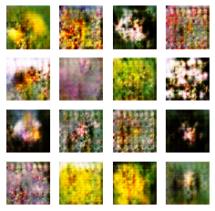

Create a DCGAN to generate images based on [tf_flowers](https://www.tensorflow.org/datasets/catalog/tf_flowers) dataset.
you can see architectures of generator and discriminator in [matlab help](https://www.mathworks.com/help/deeplearning/ug/train-generative-adversarial-network.html)

The project was implemented in **two** ways:

**1: Functional**

**2: Subclass**

Both models have the same architecture and data augmentation.
That the data augmentation is in functional model as follows:

`RandomFlip(mode='horizontal')`

`RandomRotation`

`RandomTranslation`

`RandomZoom`

but i did not use `RandomTranslation` and `RandomZoom` for subclass model.

After downloading the dataset and changing its size to 64x64 and setting the batch size to 128 and also changing their scale between -1 and 1, they augmented.

The tensor board extension was used for both, which did not work for the functional model.

The number of epoch was set to 800 for the functional model and 1000 for the subclass model.

The main difference between the two models is that in the functional model we use a custom loop for calculations, while in the subclass model these operations are defined inside the class.

The functional model obtained good results, which can be seen in its notebook file, but unfortunately, the subclass model did not have satisfactory results.
Read the notebooks to see more details.

